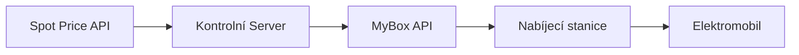

# Nabíjení podle spotových cen elektřiny

## 📊 Úvod do spotového nabíjení

Spotové ceny elektřiny se mění každou hodinu podle aktuální nabídky a poptávky na energetickém trhu. Inteligentní nabíjení podle těchto cen vám může **ušetřit až 50% nákladů** na nabíjení elektromobilu.

### Kdy jsou ceny nejnižší?

- 🌙 **Noční hodiny** (23:00 - 5:00) - nízká poptávka
- ☀️ **Slunečné dny** (11:00 - 15:00) - přebytek solární energie
- 🌬️ **Větrné dny** - přebytek větrné energie
- 📅 **Víkendy a svátky** - nižší průmyslová spotřeba

## 🔌 Implementace spotového nabíjení s MyBox

### Architektura řešení



### Krok 1: Získání spotových cen

```python
import requests
import json
from datetime import datetime, timedelta

class SpotPriceManager:
    """
    Manager pro práci se spotovými cenami elektřiny
    """

    def __init__(self, api_key, api_secret):
        self.api_key = api_key
        self.api_secret = api_secret
        self.base_url = "https://cloud.mybox.pro/admin-panel/v1"
        self.auth = (api_key, api_secret)

    def get_spot_prices(self):
        """
        Získání aktuálních spotových cen
        Pro CZ používáme data z OTE (Operátor trhu s elektřinou)
        """

        # Pro demonstraci - v reálné aplikaci použijte API OTE nebo jiného poskytovatele
        # Příklad: https://www.ote-cr.cz/cs/kratkodobe-trhy/elektrina/denni-trh

        # Simulace spotových cen na 24 hodin
        current_hour = datetime.now().hour
        base_price = 2.5  # Základní cena v Kč/kWh

        # Simulace cenového profilu během dne
        price_profile = {
            0: 0.7, 1: 0.6, 2: 0.5, 3: 0.5, 4: 0.6, 5: 0.8,  # Noc
            6: 1.2, 7: 1.5, 8: 1.4, 9: 1.3, 10: 1.0, 11: 0.9,  # Ráno
            12: 0.8, 13: 0.9, 14: 1.0, 15: 1.1, 16: 1.3, 17: 1.6,  # Odpoledne
            18: 1.8, 19: 1.7, 20: 1.5, 21: 1.3, 22: 1.0, 23: 0.8  # Večer
        }

        prices = []
        for hour in range(24):
            time = datetime.now().replace(hour=hour, minute=0, second=0, microsecond=0)
            if time.hour < current_hour:
                time += timedelta(days=1)

            prices.append({
                "time": time.isoformat(),
                "hour": hour,
                "price_czk_kwh": base_price * price_profile.get(hour, 1.0),
                "price_eur_mwh": base_price * price_profile.get(hour, 1.0) * 40  # Převod na EUR/MWh
            })

        return sorted(prices, key=lambda x: x["price_czk_kwh"])

    def find_cheapest_hours(self, hours_needed=4, max_price=None):
        """
        Najde nejlevnější hodiny pro nabíjení

        Args:
            hours_needed: Počet hodin potřebných pro nabíjení
            max_price: Maximální akceptovatelná cena (Kč/kWh)
        """

        prices = self.get_spot_prices()

        if max_price:
            prices = [p for p in prices if p["price_czk_kwh"] <= max_price]

        # Najít nejlevnější souvislé období
        cheapest_period = self._find_continuous_period(prices, hours_needed)

        return cheapest_period

    def _find_continuous_period(self, prices, hours_needed):
        """
        Najde nejlevnější souvislé období pro nabíjení
        """

        best_period = None
        best_total_price = float('inf')

        for i in range(len(prices) - hours_needed + 1):
            period = prices[i:i+hours_needed]
            total_price = sum(p["price_czk_kwh"] for p in period)

            if total_price < best_total_price:
                best_total_price = total_price
                best_period = period

        if best_period:
            return {
                "start_time": best_period[0]["time"],
                "end_time": best_period[-1]["time"],
                "hours": best_period,
                "avg_price": best_total_price / hours_needed,
                "total_price": best_total_price
            }

        return None
```

### Krok 2: Automatické řízení nabíjení

```python
class SmartChargingController:
    """
    Kontrolér pro inteligentní nabíjení podle cen
    """

    def __init__(self, device_id, api_key, api_secret):
        self.device_id = device_id
        self.api_key = api_key
        self.api_secret = api_secret
        self.base_url = "https://cloud.mybox.pro/admin-panel/v1"
        self.auth = (api_key, api_secret)
        self.price_manager = SpotPriceManager(api_key, api_secret)

    def calculate_charging_time(self, battery_capacity_kwh, current_soc_percent, target_soc_percent, charging_power_kw):
        """
        Výpočet potřebného času nabíjení
        """

        energy_needed = battery_capacity_kwh * (target_soc_percent - current_soc_percent) / 100
        charging_time_hours = energy_needed / charging_power_kw

        return {
            "energy_needed_kwh": energy_needed,
            "time_hours": charging_time_hours,
            "time_minutes": charging_time_hours * 60
        }

    def schedule_charging(self, battery_capacity_kwh=60, current_soc=20, target_soc=80, max_price=3.0):
        """
        Naplánování nabíjení podle spotových cen

        Args:
            battery_capacity_kwh: Kapacita baterie (kWh)
            current_soc: Aktuální stav nabití (%)
            target_soc: Cílový stav nabití (%)
            max_price: Maximální cena za kWh
        """

        # Výpočet potřebného času
        charging_info = self.calculate_charging_time(
            battery_capacity_kwh,
            current_soc,
            target_soc,
            charging_power_kw=11  # 11 kW pro 3-fázové nabíjení
        )

        hours_needed = int(charging_info["time_hours"] + 0.5)  # Zaokrouhlení nahoru

        # Najít nejlevnější období
        cheapest_period = self.price_manager.find_cheapest_hours(hours_needed, max_price)

        if cheapest_period:
            print(f"📅 Optimální nabíjecí plán nalezen!")
            print(f"⏰ Start: {cheapest_period['start_time']}")
            print(f"⏰ Konec: {cheapest_period['end_time']}")
            print(f"💰 Průměrná cena: {cheapest_period['avg_price']:.2f} Kč/kWh")
            print(f"⚡ Energie: {charging_info['energy_needed_kwh']:.2f} kWh")
            print(f"💵 Celková cena: {cheapest_period['avg_price'] * charging_info['energy_needed_kwh']:.2f} Kč")

            # Aplikovat plán
            self._apply_charging_schedule(cheapest_period)

            return cheapest_period
        else:
            print("❌ Nelze najít vhodné období pro nabíjení s danou cenovou limitací")
            return None

    def _apply_charging_schedule(self, schedule):
        """
        Aplikace nabíjecího plánu na zařízení
        """

        start_time = datetime.fromisoformat(schedule["start_time"])

        # Pokud je čas v budoucnosti, nastavit odložený start
        if start_time > datetime.now():
            delay_minutes = int((start_time - datetime.now()).total_seconds() / 60)
            self._set_delayed_charging(delay_minutes)
        else:
            # Začít nabíjet okamžitě
            self._start_charging()

    def _start_charging(self):
        """
        Spuštění nabíjení
        """

        response = requests.post(
            f"{self.base_url}/external/device/{self.device_id}/action",
            auth=self.auth,
            json={
                "action": "start_charging",
                "parameters": {
                    "max_current": 16  # 16A
                }
            }
        )

        return response.json()

    def _stop_charging(self):
        """
        Zastavení nabíjení
        """

        response = requests.post(
            f"{self.base_url}/external/device/{self.device_id}/action",
            auth=self.auth,
            json={
                "action": "stop_charging"
            }
        )

        return response.json()

    def _set_delayed_charging(self, delay_minutes):
        """
        Nastavení odloženého startu nabíjení
        """

        print(f"⏱️ Nabíjení začne za {delay_minutes} minut")

        # Implementace pomocí scheduleru nebo cron jobu
        # V produkci byste použili robustnější řešení
        import threading

        def delayed_start():
            time.sleep(delay_minutes * 60)
            self._start_charging()
            print("✅ Nabíjení zahájeno!")

        thread = threading.Thread(target=delayed_start)
        thread.daemon = True
        thread.start()
```

### Krok 3: Adaptivní nabíjení s predikcí cen

```python
import numpy as np
from sklearn.linear_model import LinearRegression
from datetime import datetime, timedelta

class AdaptiveChargingAI:
    """
    AI-powered adaptivní nabíjení s predikcí cen
    """

    def __init__(self, device_id, api_credentials):
        self.device_id = device_id
        self.api_credentials = api_credentials
        self.price_history = []
        self.model = LinearRegression()

    def collect_price_history(self, days=30):
        """
        Sbírání historických dat o cenách
        """

        # V reálné aplikaci byste načetli data z databáze
        # Pro demonstraci generujeme syntetická data

        history = []
        for day in range(days):
            for hour in range(24):
                timestamp = datetime.now() - timedelta(days=day, hours=hour)
                # Simulace sezónních a denních vzorů
                base_price = 2.5
                hour_factor = 1 + 0.5 * np.sin(2 * np.pi * hour / 24)
                day_factor = 1 + 0.2 * np.sin(2 * np.pi * day / 7)
                random_factor = np.random.normal(1, 0.1)

                price = base_price * hour_factor * day_factor * random_factor

                history.append({
                    "timestamp": timestamp,
                    "hour": hour,
                    "weekday": timestamp.weekday(),
                    "price": max(0.5, price)  # Minimální cena 0.5 Kč/kWh
                })

        self.price_history = history
        return history

    def train_prediction_model(self):
        """
        Trénování predikčního modelu
        """

        if not self.price_history:
            self.collect_price_history()

        # Příprava dat pro trénování
        X = []
        y = []

        for record in self.price_history:
            features = [
                record["hour"],
                record["weekday"],
                np.sin(2 * np.pi * record["hour"] / 24),  # Cyklická hodina
                np.cos(2 * np.pi * record["hour"] / 24),
                np.sin(2 * np.pi * record["weekday"] / 7),  # Cyklický den
                np.cos(2 * np.pi * record["weekday"] / 7)
            ]
            X.append(features)
            y.append(record["price"])

        # Trénování modelu
        self.model.fit(X, y)

        print("✅ Model pro predikci cen natrénován")

    def predict_prices(self, hours_ahead=24):
        """
        Predikce budoucích cen
        """

        predictions = []
        current_time = datetime.now()

        for h in range(hours_ahead):
            future_time = current_time + timedelta(hours=h)
            features = [
                future_time.hour,
                future_time.weekday(),
                np.sin(2 * np.pi * future_time.hour / 24),
                np.cos(2 * np.pi * future_time.hour / 24),
                np.sin(2 * np.pi * future_time.weekday() / 7),
                np.cos(2 * np.pi * future_time.weekday() / 7)
            ]

            predicted_price = self.model.predict([features])[0]

            predictions.append({
                "time": future_time.isoformat(),
                "predicted_price": predicted_price,
                "confidence": 0.85  # Simulovaná confidence
            })

        return predictions

    def optimize_charging_strategy(self, battery_info, constraints):
        """
        Optimalizace nabíjecí strategie pomocí AI

        Args:
            battery_info: Info o baterii (kapacita, SoC, atd.)
            constraints: Omezení (deadline, max cena, atd.)
        """

        predictions = self.predict_prices(48)  # Predikce na 48 hodin

        # Dynamické programování pro optimální plán
        strategy = self._dynamic_programming_optimization(
            predictions,
            battery_info,
            constraints
        )

        return strategy

    def _dynamic_programming_optimization(self, predictions, battery_info, constraints):
        """
        Optimalizace pomocí dynamického programování
        """

        energy_needed = battery_info["capacity_kwh"] * \
                       (battery_info["target_soc"] - battery_info["current_soc"]) / 100

        deadline = constraints.get("deadline", 24)  # hodiny
        max_price = constraints.get("max_price", float('inf'))
        prefer_green = constraints.get("prefer_green_energy", False)

        # Inicializace DP tabulky
        dp = {}
        path = {}

        def solve(hour, energy_remaining):
            if energy_remaining <= 0:
                return 0
            if hour >= min(len(predictions), deadline):
                return float('inf')

            if (hour, energy_remaining) in dp:
                return dp[(hour, energy_remaining)]

            # Možnosti: nabíjet nebo čekat
            price = predictions[hour]["predicted_price"]

            # Čekat
            wait_cost = solve(hour + 1, energy_remaining)

            # Nabíjet
            charge_amount = min(11, energy_remaining)  # Max 11 kWh za hodinu
            charge_cost = price * charge_amount + solve(hour + 1, energy_remaining - charge_amount)

            if charge_cost < wait_cost:
                dp[(hour, energy_remaining)] = charge_cost
                path[(hour, energy_remaining)] = "charge"
            else:
                dp[(hour, energy_remaining)] = wait_cost
                path[(hour, energy_remaining)] = "wait"

            return dp[(hour, energy_remaining)]

        total_cost = solve(0, energy_needed)

        # Rekonstrukce optimálního plánu
        plan = []
        hour = 0
        energy = energy_needed

        while hour < len(predictions) and energy > 0:
            action = path.get((hour, energy), "wait")
            if action == "charge":
                charge_amount = min(11, energy)
                plan.append({
                    "hour": hour,
                    "action": "charge",
                    "amount_kwh": charge_amount,
                    "price": predictions[hour]["predicted_price"]
                })
                energy -= charge_amount
            hour += 1

        return {
            "total_cost": total_cost,
            "total_energy": energy_needed,
            "avg_price": total_cost / energy_needed if energy_needed > 0 else 0,
            "plan": plan
        }
```

### Krok 4: Integrace s energetickým mixem

```python
class GreenEnergyOptimizer:
    """
    Optimalizace nabíjení podle podílu zelené energie
    """

    def __init__(self, api_credentials):
        self.api_credentials = api_credentials

    def get_energy_mix(self):
        """
        Získání aktuálního energetického mixu
        """

        # Data z ČEPS nebo podobného zdroje
        # Pro demonstraci používáme simulovaná data

        current_hour = datetime.now().hour

        # Simulace energetického mixu během dne
        if 11 <= current_hour <= 15:  # Polední hodiny - více solární
            solar = 35
            wind = 15
            nuclear = 30
            coal = 15
            gas = 5
        elif 18 <= current_hour <= 22:  # Večerní špička
            solar = 0
            wind = 10
            nuclear = 35
            coal = 40
            gas = 15
        else:  # Noc
            solar = 0
            wind = 20
            nuclear = 40
            coal = 30
            gas = 10

        return {
            "timestamp": datetime.now().isoformat(),
            "solar_percent": solar,
            "wind_percent": wind,
            "nuclear_percent": nuclear,
            "coal_percent": coal,
            "gas_percent": gas,
            "renewable_percent": solar + wind,
            "carbon_free_percent": solar + wind + nuclear
        }

    def calculate_carbon_footprint(self, energy_kwh, energy_mix):
        """
        Výpočet uhlíkové stopy nabíjení
        """

        # CO2 emisní faktory (kg CO2/kWh)
        emission_factors = {
            "solar": 0.04,
            "wind": 0.01,
            "nuclear": 0.01,
            "coal": 0.82,
            "gas": 0.49
        }

        total_emissions = 0

        for source, factor in emission_factors.items():
            percent = energy_mix.get(f"{source}_percent", 0) / 100
            total_emissions += energy_kwh * percent * factor

        return {
            "total_co2_kg": total_emissions,
            "co2_per_kwh": total_emissions / energy_kwh if energy_kwh > 0 else 0,
            "trees_equivalent": total_emissions / 21  # Jeden strom absorbuje ~21 kg CO2 ročně
        }

    def find_greenest_hours(self, hours_needed=4):
        """
        Najde hodiny s nejvyšším podílem zelené energie
        """

        green_hours = []

        for hour in range(24):
            # Simulace predikce energetického mixu
            mix = self.get_energy_mix()  # V reálu byste použili predikci
            green_hours.append({
                "hour": hour,
                "renewable_percent": mix["renewable_percent"],
                "carbon_free_percent": mix["carbon_free_percent"]
            })

        # Seřadit podle podílu obnovitelných zdrojů
        green_hours.sort(key=lambda x: x["renewable_percent"], reverse=True)

        return green_hours[:hours_needed]
```

## 📱 Monitoring a notifikace

```python
class ChargingMonitor:
    """
    Monitoring nabíjení s notifikacemi
    """

    def __init__(self, device_id, api_credentials):
        self.device_id = device_id
        self.api_credentials = api_credentials
        self.notification_endpoints = []

    def add_notification(self, endpoint_type, config):
        """
        Přidání notifikačního endpointu
        """

        self.notification_endpoints.append({
            "type": endpoint_type,
            "config": config
        })

    def monitor_charging_session(self):
        """
        Sledování probíhající nabíjecí relace
        """

        session_data = {
            "start_time": datetime.now(),
            "energy_delivered": 0,
            "cost": 0,
            "carbon_saved": 0
        }

        while True:
            # Získat aktuální stav
            status = self._get_charging_status()

            if status["is_charging"]:
                # Update statistik
                session_data["energy_delivered"] = status["energy_kwh"]
                session_data["cost"] = status["energy_kwh"] * status["current_price"]

                # Kontrola milníků
                if session_data["energy_delivered"] >= 10 and session_data["energy_delivered"] < 10.1:
                    self._send_notification("10 kWh nabito", session_data)

                if status["soc_percent"] >= 80:
                    self._send_notification("Baterie nabita na 80%", session_data)
                    break

            time.sleep(60)  # Kontrola každou minutu

        # Finální report
        self._generate_session_report(session_data)

    def _send_notification(self, message, data):
        """
        Odeslání notifikace
        """

        for endpoint in self.notification_endpoints:
            if endpoint["type"] == "email":
                self._send_email(endpoint["config"], message, data)
            elif endpoint["type"] == "webhook":
                self._send_webhook(endpoint["config"], message, data)

    def _generate_session_report(self, session_data):
        """
        Generování reportu nabíjecí relace
        """

        duration = datetime.now() - session_data["start_time"]

        report = f"""
        📊 REPORT NABÍJECÍ RELACE
        ========================

        ⏱️ Doba nabíjení: {duration}
        ⚡ Nabito: {session_data['energy_delivered']:.2f} kWh
        💰 Celková cena: {session_data['cost']:.2f} Kč
        💚 Průměrná cena: {session_data['cost']/session_data['energy_delivered']:.2f} Kč/kWh
        🌱 Ušetřeno CO2: {session_data['carbon_saved']:.2f} kg

        Děkujeme za používání inteligentního nabíjení!
        """

        return report
```

## 🎯 Příklad kompletního použití

```python
# Konfigurace
API_KEY = "YOUR_API_KEY"
API_SECRET = "YOUR_API_SECRET"
DEVICE_ID = "qfeb-od13-ul2c-sgrl"

# Inicializace kontroléru
controller = SmartChargingController(DEVICE_ID, API_KEY, API_SECRET)

# Nastavení parametrů vozidla
vehicle_params = {
    "battery_capacity_kwh": 60,  # Tesla Model 3 SR+
    "current_soc": 25,  # Aktuální nabití 25%
    "target_soc": 80,   # Cílové nabití 80%
    "deadline_hours": 12  # Potřebuji nabít do 12 hodin
}

# Naplánování nabíjení
charging_plan = controller.schedule_charging(
    battery_capacity_kwh=vehicle_params["battery_capacity_kwh"],
    current_soc=vehicle_params["current_soc"],
    target_soc=vehicle_params["target_soc"],
    max_price=3.0  # Maximální cena 3 Kč/kWh
)

# Spuštění monitoringu
monitor = ChargingMonitor(DEVICE_ID, (API_KEY, API_SECRET))
monitor.add_notification("email", {"to": "user@example.com"})
monitor.monitor_charging_session()
```

## 💡 Tipy pro maximální úspory

1. **Nastavte flexibilní deadline** - čím více času, tím lepší ceny
2. **Využijte víkendy** - obvykle nižší ceny
3. **Sledujte predikce počasí** - větrné a slunečné dny = levnější energie
4. **Kombinujte s domácí fotovoltaikou** - prioritizujte vlastní výrobu
5. **Nastavte cenové limity** - ochrana před cenovými špičkami

## 📚 Související návody

- [DLM - Dynamic Load Management](./dlm-setup)
- [Integrace s fotovoltaikou](./solar-integration)
- [Automatizace domácnosti](./home-automation)